# Markdown Links

## Índice

1. Preámbulo
2. Resumen del proyecto
3. Objetivos de aprendizaje
4. Consideraciones generales
5. Criterios de aceptación mínimos del proyecto
6. Diagrama de flujo
7. Planificación
8. Antes de codear
9. Implementación
10. Checklist
***
## 1. Preámbulo

[Markdown](https://es.wikipedia.org/wiki/Markdown) es un lenguaje de marcado
ligero muy popular entre developers. Es usado en muchísimas plataformas que
manejan texto plano (GitHub, foros, blogs, ...) y es muy común
encontrar varios archivos en ese formato en cualquier tipo de repositorio
(empezando por el tradicional `README.md`).

Estos archivos `Markdown` normalmente contienen _links_ (vínculos/ligas) que
muchas veces están rotos o ya no son válidos y eso perjudica mucho el valor de
la información que se quiere compartir.

Dentro de una comunidad de código abierto, nos han propuesto crear una
herramienta usando [Node.js](https://nodejs.org/), que lea y analice archivos
en formato `Markdown`, para verificar los links que contengan y reportar
algunas estadísticas.


## 2. Resumen del proyecto

En este proyecto  se creo una herramienta de línea de comandos (Cli), así como la librería en JavaScript, un programa que se ejecute usando Node.js


[Node.js](https://nodejs.org/es/) es un entorno de ejecución para JavaScript
construido con el [motor de JavaScript V8 de Chrome](https://developers.google.com/v8/).
que nos permite ejecutar JavaScript en el entorno del sistema operativo,
ya sea en máquina o un servidor, lo cual nos abre las puertas para poder
interactuar con el sistema en sí, archivos, redes, etc.

## 3. OBJETIVOS DE APRENDIZAJE:
#### JavaScript

- [ X ] **Diferenciar entre tipos de datos primitivos y no primitivos**
- [ X ] **Arrays (arreglos)**
  <details><summary>Links</summary><p>
  * [Arreglos](https://curriculum.laboratoria.la/es/topics/javascript/04-arrays)
  * [Array - MDN](https://developer.mozilla.org/es/docs/Web/JavaScript/Reference/Global_Objects/Array/)
  * [Array.prototype.sort() - MDN](https://developer.mozilla.org/es/docs/Web/JavaScript/Reference/Global_Objects/Array/sort)
  * [Array.prototype.forEach() - MDN](https://developer.mozilla.org/es/docs/Web/JavaScript/Reference/Global_Objects/Array/forEach)
  * [Array.prototype.map() - MDN](https://developer.mozilla.org/es/docs/Web/JavaScript/Reference/Global_Objects/Array/map)
  * [Array.prototype.filter() - MDN](https://developer.mozilla.org/es/docs/Web/JavaScript/Reference/Global_Objects/Array/filter)
  * [Array.prototype.reduce() - MDN](https://developer.mozilla.org/es/docs/Web/JavaScript/Reference/Global_Objects/Array/Reduce)
</p></details>
- [ X ] **Objetos (key, value)**
  <details><summary>Links</summary><p>
  * [Objetos en JavaScript](https://curriculum.laboratoria.la/es/topics/javascript/05-objects/01-objects)
</p></details>
- [ X ] **Uso de condicionales (if-else, switch, operador ternario, lógica booleana)**
  <details><summary>Links</summary><p>
  * [Estructuras condicionales y repetitivas](https://curriculum.laboratoria.la/es/topics/javascript/02-flow-control/01-conditionals-and-loops)
  * [Tomando decisiones en tu código — condicionales - MDN](https://developer.mozilla.org/es/docs/Learn/JavaScript/Building_blocks/conditionals)
</p></details>
- [ X ] **Funciones (params, args, return)**
  <details><summary>Links</summary><p>
  * [Funciones (control de flujo)](https://curriculum.laboratoria.la/es/topics/javascript/02-flow-control/03-functions)
  * [Funciones clásicas](https://curriculum.laboratoria.la/es/topics/javascript/03-functions/01-classic)
  * [Arrow Functions](https://curriculum.laboratoria.la/es/topics/javascript/03-functions/02-arrow)
  * [Funciones — bloques de código reutilizables - MDN](https://developer.mozilla.org/es/docs/Learn/JavaScript/Building_blocks/Functions)
</p></details>
- [ X ] **Módulos de CommonJS**
  <details><summary>Links</summary><p>
  * [Modules: CommonJS modules - Node.js Docs](https://nodejs.org/docs/latest/api/modules.html)
</p></details>
- [ X ] **Diferenciar entre expresiones (expressions) y sentencias (statements)**
- [ X ] **Callbacks**
  <details><summary>Links</summary><p>
  * [Función Callback - MDN](https://developer.mozilla.org/es/docs/Glossary/Callback_function)
</p></details>
- [ X ] **Promesas**
  <details><summary>Links</summary><p>
  * [Promise - MDN](https://developer.mozilla.org/es/docs/Web/JavaScript/Reference/Global_Objects/Promise)
  * [How to Write a JavaScript Promise - freecodecamp (en inglés)](https://www.freecodecamp.org/news/how-to-write-a-javascript-promise-4ed8d44292b8/)
</p></details>
- [ X ] **Pruebas unitarias (unit tests)**
  <details><summary>Links</summary><p>
  * [Empezando con Jest - Documentación oficial](https://jestjs.io/docs/es-ES/getting-started)
</p></details>
- [ X ] **Pruebas de compatibilidad en múltiples entornos de ejecución**
- [ X ] **Uso de linter (ESLINT)**
- [ X ] **Uso de identificadores descriptivos (Nomenclatura y Semántica)**

#### Node.js
- [ X ] **Instalar y usar módulos con npm**
  <details><summary>Links</summary><p>
  * [Sitio oficial de npm (en inglés)](https://www.npmjs.com/)
</p></details>
- [ X ] **Configuración de package.json**
  <details><summary>Links</summary><p>
  * [package.json - Documentación oficial (en inglés)](https://docs.npmjs.com/files/package.json)
</p></details>
- [ X ] **Configuración de npm-scripts**
  <details><summary>Links</summary><p>
  * [scripts - Documentación oficial (en inglés)](https://docs.npmjs.com/misc/scripts)
</p></details>
- [ X ] **process (env, argv, stdin-stdout-stderr, exit-code)**
  <details><summary>Links</summary><p>
  * [Process - Documentación oficial (en inglés)](https://nodejs.org/api/process.html)
</p></details>
- [ X    ] **File system (fs, path)**
  <details><summary>Links</summary><p>
  * [File system - Documentación oficial (en inglés)](https://nodejs.org/api/fs.html)
  * [Path - Documentación oficial (en inglés)](https://nodejs.org/api/path.html)
</p></details>

## Control de Versiones (Git y GitHub)

- [ X ] **Git: Instalación y configuración**
- [ X ] **Git: Control de versiones con git (init, clone, add, commit, status, push, pull, remote)**
- [ X ] **Git: Integración de cambios entre ramas (branch, checkout, fetch, merge, reset, rebase, tag)**
- [ X ] **GitHub: Creación de cuenta y repos, configuración de llaves SSH**
- [ X ] **GitHub: Colaboración en Github (branches | forks | pull requests | code review | tags)**
- [ X ] **GitHub: Organización en Github (projects | issues | labels | milestones | releases)**
## HTTP

- [ X ] **Consulta o petición (request) y respuesta (response).**

  <details><summary>Links</summary><p>

  * [Generalidades del protocolo HTTP - MDN](https://developer.mozilla.org/es/docs/Web/HTTP/Overview)
  * [Mensajes HTTP - MDN](https://developer.mozilla.org/es/docs/Web/HTTP/Messages)
</p></details>

- [ X ] **Códigos de status de HTTP**

  <details><summary>Links</summary><p>

  * [Códigos de estado de respuesta HTTP - MDN](https://developer.mozilla.org/es/docs/Web/HTTP/Status)
  * [The Complete Guide to Status Codes for Meaningful ReST APIs - dev.to](https://dev.to/khaosdoctor/the-complete-guide-to-status-codes-for-meaningful-rest-apis-1-5c5)
</p></details>

## 4. Consideraciones generales

* El módulo es insatalable via `npm install <github-user>/DEV007-md-links`.

* Los **tests unitarios** deben cubren un mínimo del 70% de _statements_,
  _functions_, _lines_ y _branches_.

* No se utiliza `async/await`.

* Para este proyecto se establece el uso de ES Modules `(import/export)`.

## 5. Criterios de aceptación mínimos del proyecto

Para comenzar este proyecto se hace un  **_fork_** y **_clonar_** repositorio.

Antes de comenzar a codear, se hace un  **plan de acción**. para priorizar y organizar el trabajo y poder hacer
seguimiento del progreso, en Trello.

### Archivos del proyecto

* `README.md` con descripción del módulo, instrucciones de instalación/uso,
  documentación del API y ejemplos. Todo lo relevante para que cualquier
  developer que quiera usar tu librería pueda hacerlo sin inconvenientes.
* `index.js`: Desde este archivo se exporta la función (`mdLinks`).
* `package.json` con nombre, versión, descripción, autores, licencia,
  dependencias, scripts (pretest, test, ...), main, bin
* `.editorconfig` con configuración para editores de texto. Este archivo no se
  debe cambiar.
* `.eslintrc` con configuración para linter. Este archivo contiene una
  configuración básica para ESLint.
* `.gitignore` ignora `node_modules` u otras carpetas que no deban
  incluirse en control de versiones (`git`).
* `test/md-links.spec.js` contiene los tests unitarios para la función
  `mdLinks()`.

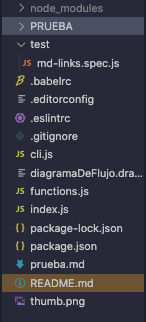

El módulo debe poder **importarse** en otros scripts de Node.js y debe ofrecer la
siguiente interfaz:

#### `mdLinks(path, options)`

##### Argumentos

* `path`: Ruta **absoluta** o **relativa** al **archivo**
Si la ruta pasada es relativa, debe resolverse como relativa.
* `options`: Un objeto con **únicamente** la siguiente propiedad:
  - `validate`: Booleano que determina si se desea validar los links
    encontrados.

##### Valor de retorno

La función debe **retornar una promesa** (`Promise`) que **resuelve a un arreglo**
(`Array`) de objetos (`Object`), donde cada objeto representa un link y contiene
las siguientes propiedades.
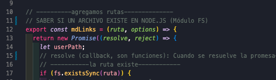

Con `validate:false` :

* `href`: URL encontrada.
* `text`: Texto que aparecía dentro del link (`<a>`).
* `file`: Ruta del archivo donde se encontró el link.

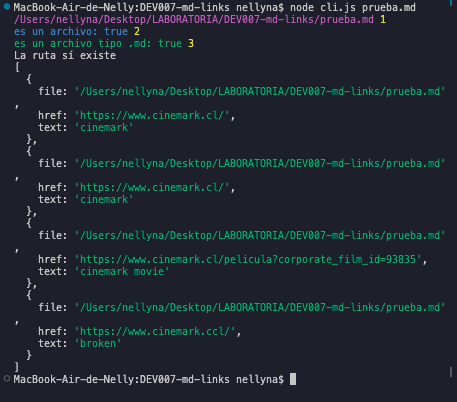

Con `validate:true` :

* `href`: URL encontrada.
* `text`: Texto que aparecía dentro del link (`<a>`).
* `file`: Ruta del archivo donde se encontró el link.
* `status`: Código de respuesta HTTP.
* `ok`: Mensaje `fail` en caso de fallo u `ok` en caso de éxito.
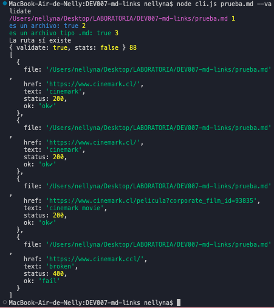
#### Ejemplo

```js
mdLinks("prueba.md")
  .then((pathIsAbsolute) => {
    console.log((pathIsAbsolute),6);
  })
  .catch((error) => {
    console.error((chalk.red("Error:", error)),6.1);
  });

```

### 2) CLI (Command Line Interface - Interfaz de Línea de Comando)

El ejecutable de nuestra aplicación debe poder ejecutarse de la siguiente
manera a través de la **terminal**:

`node cli.js`

Ejemplo de archivo con links:

```sh
Link de cinemark [cinemark](https://www.cinemark.cl/)

Link de película [cinemark movie](https://www.cinemark.cl/pelicula?corporate_film_id=93835)

Link roto [broken](https://www.cinemark.ccl/)

```
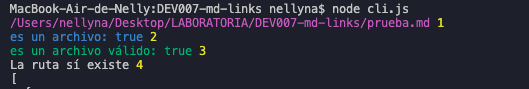


El comportamiento por defecto debe identificar el archivo markdown (a partir de la ruta que recibe como
argumento), analizar el archivo Markdown e imprimir los links que vaya
encontrando, junto con la ruta del archivo donde aparece y el texto
que hay dentro del link .

## 6.- Diagrama de flujo
Para visualizar las tareas y objetivos, se llevó a cabo un `diagrama de flujo`.


Seguido de un `pseudocódigo` (representados por comentarios dentro del código)

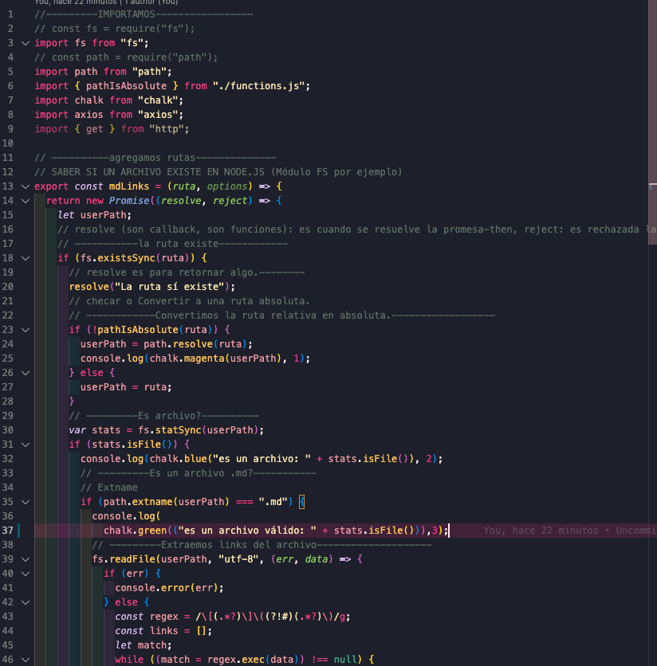
## 7.- Planificación

En este proyecto para su planificación, tareas y objetivos utilizamos la herramienta de planificación Trello de primera instancia y utilizamos la herramienta de organización de GitHub llamada **Github Projects**, tambien para familiarizarse con ella.
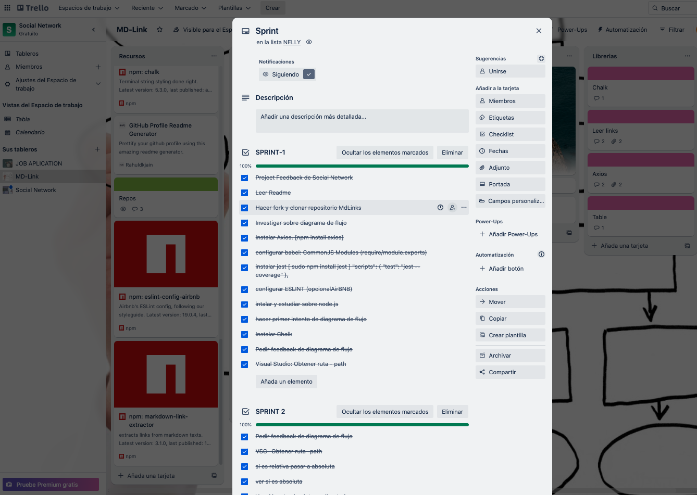
## 8.-Antes de codear

- Nos aseguramos de comprender el proyecto.

- Se estudio previamente sobre  **NodeJS**

- se decidió desde un comienzo la utilización de:
`ES Modules`, es decir, **import/export**, en lugar de
`CommonJS Modules` (**require/module.exports**).

- Se instalaron todas las paquetes a utilizar como Jest.js, axios, chalk, babel y EsLint.


## 9.-Options

##### `--validate`

Si pasamos la opción `--validate`, el módulo debe hacer una petición HTTP para
averiguar si el link funciona o no. Si el link resulta en una redirección a una
URL que responde ok, entonces consideraremos el link como ok.

Por ejemplo:

Vemos que el _output_ en este caso incluye la palabra `ok` o `fail` después de
la URL, así como el status de la respuesta recibida a la petición HTTP a dicha
URL.


##### `--stats`

Si pasamos la opción `--stats` el output (salida) será un texto con estadísticas
básicas sobre los links.

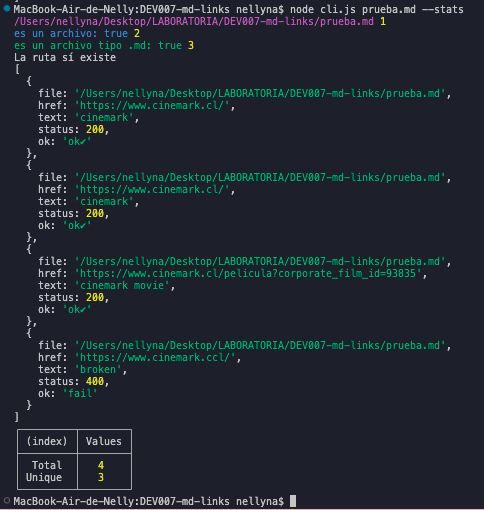

También podemos combinar `--stats` y `--validate` para obtener estadísticas que
necesiten de los resultados de la validación.

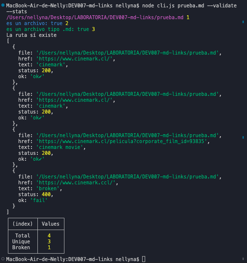

## 10.-Implementación

La implementación de este proyecto tiene varias partes: leer del sistema de
archivos, recibir argumentos a través de la línea de comando, analizar texto,
hacer consultas HTTP

* Se utilizó:
  [expresiones regulares (`RegExp`)](https://developer.mozilla.org/es/docs/Web/JavaScript/Guide/Regular_Expressions).

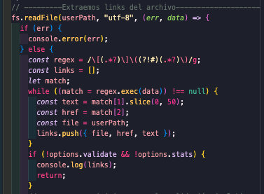

## 11.-Checklist

### General

* [ X ] Puede instalarse via `npm install --global <github-user>/md-links`

### API `mdLinks(path, opts)`

* [ X ] El módulo exporta una función con la interfaz (API) esperada.
* [ X ] Implementa soporte para archivo individual
* [ X ] Implementa `options.validate`

### CLI

* [ X ] Expone ejecutable `md-links` en el path (configurado en `package.json`)
* [ X ] Se ejecuta sin errores / output esperado
* [ X ] Implementa `--validate`
* [ X ] Implementa `--stats`

### Pruebas / tests

* [ X ] Pruebas unitarias cubren un mínimo del 70% de statements, functions,
  lines, y branches.
* [ X ] Pasa tests (y linters) (`npm test`).

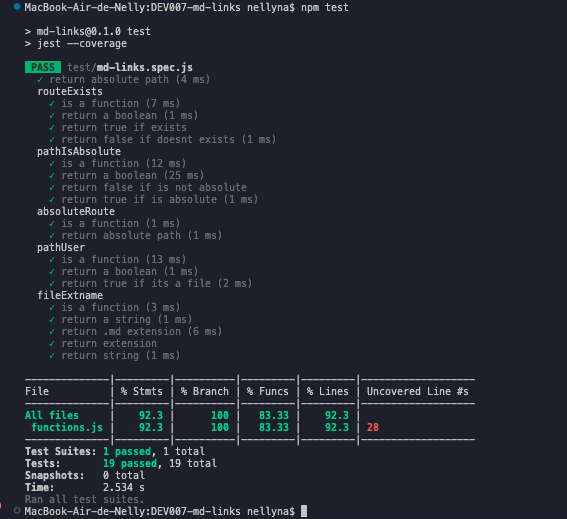
